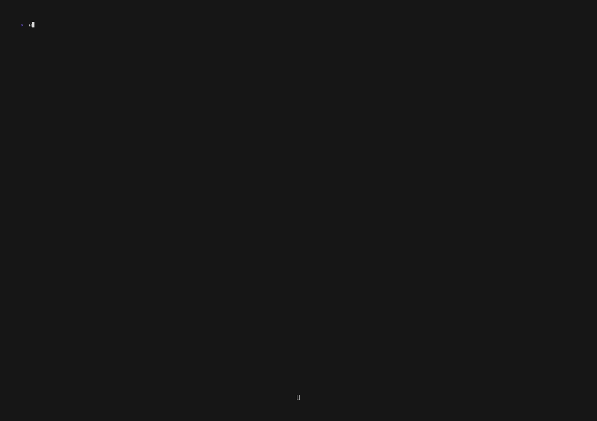

# 📝 Terminal Journal Viewer with Bubble Tea

  
_(If the video doesn't auto-play, click to download and view it locally.)_

Welcome to the **Terminal Journal Viewer**—a feature-rich journal navigation and viewing application built entirely in Golang, leveraging the [Bubble Tea framework](https://github.com/charmbracelet/bubbletea) for a smooth and responsive terminal UI. 🎉

This application is built to enhance user experience of those using the [jrnl CLI tool](https://jrnl.sh/). If you use `jrnl` to maintain your journal, this app is the **perfect companion** to enhance your workflow as it directly pulls your entries from the selected journal created by `jrnl`.

## ✨ Features

- **🗓️ Intuitive Date Navigation**  
  Use the **date picker** at the bottom to seamlessly browse through your journal entries by day, month, or year.

- **📆 Multiple Modes for Date Picking**

  - **Monthly Mode**: Quickly navigate through days in a month.
  - **Month Picker Mode**: Jump between months effortlessly.
  - **Year Picker Mode**: Fast-forward or rewind across years.

- **📖 Journal View Mode**  
  View your journal entries, each one distinctly separated for clarity. This mode includes:
  - Pagination for scrolling through longer entries.
  - Smooth transitions between entries.

## 🚀 Why Use This Application?

This project is ideal for users who prefer the command line and want a visually appealing yet straightforward way to access and read their journal entries. With this application, managing your journals becomes a joy rather than a chore. ✍️

## 📚Technologies Used

- **Golang** 🐹
- **Bubble tea framework** 🍵
